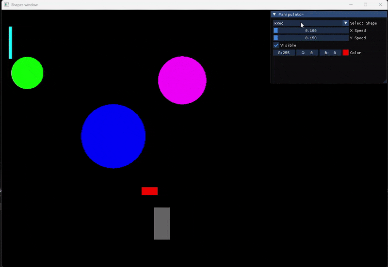

# 🎨 Shape Manipulator (C++ - (SFML + ImGui))

A C++ project that uses **SFML** and **ImGui-SFML** to render and manipulate shapes in real-time.  
Shapes (rectangles & circles) are loaded from a config file, displayed in an SFML window, and controlled via an ImGui GUI.

---
## 📸 Preview



## 🚀 Features
- Load shape data from `config.txt`.
- Support for **rectangles** and **circles**.
- Real-time GUI controls:
  - Select shape from dropdown
  - Adjust X/Y speed
  - Toggle visibility
  - Change color with picker
- Smooth rendering at 60 FPS.

---

## 🛠 Requirements
- **C++17**
- **SFML** (graphics, window, system)
- **ImGui-SFML**

---

## ▶️ Build & Run

### Linux / g++
```bash
g++ project1/main.cpp -o shapes \
    -lsfml-graphics -lsfml-window -lsfml-system \
    -lImGui-SFML -lImGui
./shapes
```

## 🖥 Windows (Visual Studio)

1. Open `project1.sln`  
2. Configure **SFML** & **ImGui-SFML** in project properties  
3. Build & Run  

---

## 📂 Config File (`config.txt`)

**Example:**

window 800 600

rectangle rect1 100 100 5 5 255 0 0

circle circ1 200 200 3 3 0 255 0


---

## 📸 Controls
- **Select Shape** → dropdown list  
- **X Speed / Y Speed** → movement speed  
- **Visible** → toggle on/off  
- **Color Picker** → live color change  

---

## 💡 Future Ideas
- Save updated values back to file  
- Add triangles & polygons  
- Resize and rotate shapes  
